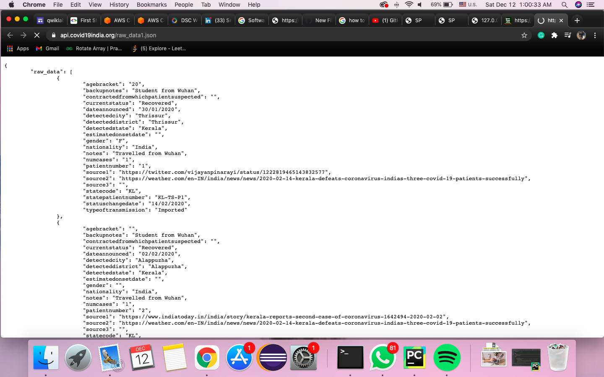
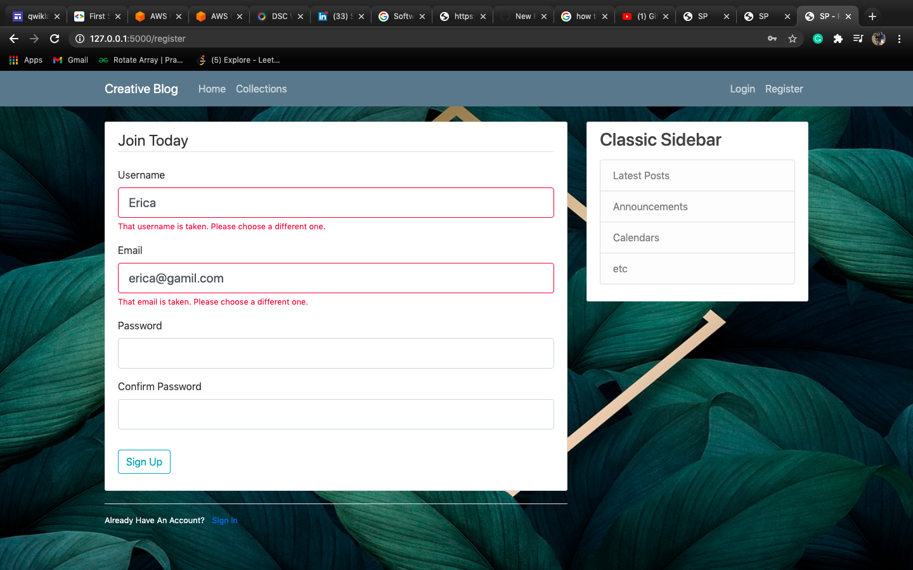

# Zingly

<h2>Link for the deployed project</h2>
https://zingly.herokuapp.com/

     

HOME PAGE is where it contains all the options for login, collections, Register and with a classic sidebar.
If you are a new user then you need to register first, you should select a unique email and password, if a user with the same username or email id exist then your registration will fail and you have to register again with new credentials.

Your email and password should be in valid format otherwise it'll give validation error message for the user.
If you are and existing user then you need to sign up or log in.

<table>
<tr>
<td></td>
<td></td>
</tr>
<tr>
<td></td>
<td></td>
</tr>
</table>

Current user can add new post or url by new post, enter the url name you want to provide and the particular url, if the entered url will be valid then on submitting it. The entered url will open in a new tab and your current screen will be the display screen.

User can add URLs of different APIs and it will open all these links in other tabs. If you'll enter any invalid then it will flash a message "Entered URL is incorrect please try again".
URLs entered by the user will be stored in a database and all the previous enterned links by all the users will be displayed in the collections section.
All the URLs entered by a particular user will be stored in the database and can be seen just by clicking on the user's name.

You can also update and delete your post in future if you want.

<h2>Here I've added some images for better understanding</h2>

When the user with same credential exist.

when the user enters some wrong details while log in.

<table>
<tr>
<td><td>
<td></td>
</tr>
</table>

Collection if all the URLs, posted by all the users

Account can be updated and profile photo can be added.

<table>
<tr>
<td></td>
<td></td>
</tr>
</table>

User can update or delete the post anytime

when invalid URLs is entered

<table>
<tr>
<td></td>
<td></td>
</tr>
</table>

